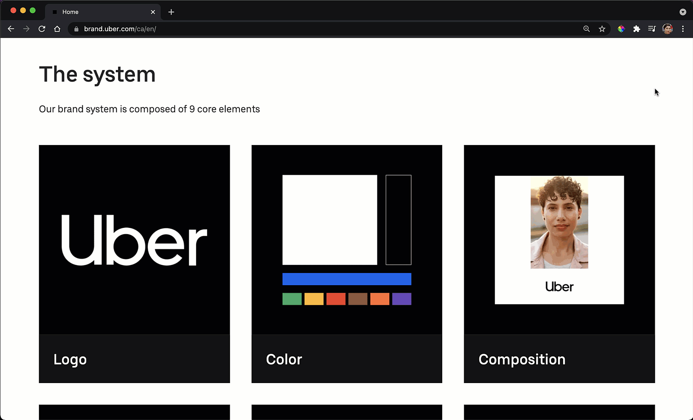
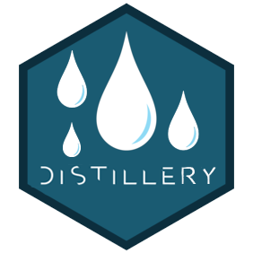

# Session 3: Writing and design

Due to timing, this session was converted to asynchronous. All the resources are below.

## Writing, colour and font advice

**These slides were prepared by [Dee Keilholz, Communications Officer](https://www.statistics.utoronto.ca/people/directories/staff/megan-whitehead-douglas-med), for the ISSC.**

<iframe src="https://docs.google.com/presentation/d/1BWs_5wnoWR3vhI_layCnnz2QfUMs5IGJHQNDLnw6JD4/embed" style="width:100%;height:500px">

</iframe>

## Colours

There are SO many ways to mix, match and pick colours.

If you're looking for some inspiration, I recommend playing with [coolors.co](https://coolors.co/). Once you go to the site, click 'Start the generator!' and play with it to get a colour palette you like. You'll see the hexcodes (6, hence 'hex', letters/numbers with a hashtag[^session3-1], \#) at the bottom of the swatches.

[^session3-1]: 🤔 Did you know? The real name of the \# symbol, called the 'pound' symbol by some, is 'octothorp'.

<i class="fa fa-chevron-circle-right"></i> [*You might also like these slides about colours and ggplot from Tidy Tuesday and Talk.*](https://uoft-doss-issc.github.io/ggplot-colour-palettes/ggplot-colour-palettes.html#1)

When I am working with a client and need to use their colours, either they send me a brand guide with information about the colours, in the form of hexcodes and/or RGB values (e.g. this guide to brand colours from [Uber](https://brand.uber.com/us/en/color/)), or I use a tool like the [ColorPick Eyedropper](https://chrome.google.com/webstore/detail/colorpick-eyedropper/ohcpnigalekghcmgcdcenkpelffpdolg?hl=en) extension for Chrome to get the codes for the colours they use on their website.

```{r, fig.align = "center", echo = FALSE}

if (knitr:::is_latex_output()) {
  knitr::asis_output('In the HTML version of these notes there is a GIF here.')
} else {
 
}

```

*GIF description: Demonstration of the Colour Pick Eyedropper extension for Chrome to 'pick' colours from Uber's brand site.*

## Editing your CSS (demo)

Cascading Style Sheets (CSS) let you modify the colours, fonts, spacing and other design features of your website in a consistent way. If you've used 'Styles' in Microsoft Word, it is a similar idea, e.g., everything of type Heading 1 will look the same. I've never taken a formal course in CSS and just learn things as I need them, so am in no way an expert. Believe in your ability to Google! Check out this much more thorough introduction from [W3 Schools](https://www.w3schools.com/css/css_intro.asp).

Our goal is to create and edit a .css file that has the instructions for how different elements of our website should look.

**For a more more comprehensive introduction, check out the following instructions from the Distill for R team for a range of examples and key information: <https://rstudio.github.io/distill/website.html#theming>.**


In session 1, I created the following site for the ISSC: <https://uoft-doss-issc.github.io/task2/>. In this demo we are going to go from the top panel to the bottom panel of the below image. Note the changes to the fonts, sizes and colours.

```{r, fig.align = "center", echo = FALSE}
knitr::include_graphics("images/task2v3.png")
```

Suppose I played with www.coolors.co and decided I liked [this palette](https://coolors.co/555b6e-89b0ae-bee3db-faf9f9-ffd6ba) and want to make all my titles be in a cutesy font like [Zen Loop](https://fonts.google.com/specimen/Zen+Loop) but go for something standard, like [Lato](https://fonts.google.com/specimen/Lato), for the main (body) text

```{r, fig.align = "center", echo = FALSE}
knitr::include_graphics("images/my-pal.png")
```

I want to make the following changes:

1.  Change the header bar colour from bluish to 'Morning Blue'.

2.  Turn links in the header bar 'Apricot' when I hover over them.

3.  Make the background of the side 'Cultured'.

4.  Make all my body text be the 'Independence Blue' colour.

5.  Make all the headings 'Morning Blue'.

6.  Turn links in body text 'Powder Blue' when hovered over.

7.  Set my headings to be in the Zen Loop font.

    1.  Make the website title (left side of navbar) and the links (right side of the navbar) 30px (title-size & text-size in the .distill-site-header class).

    2.  Set h1 (the ISSC under the picture, likely to be your name in yours, if you used postcards) to size 100px.

    3.  Set h2 (the Bio/Education/Experience on the homepage) to 60px.

8.  Set my body text be in the Lato font.

Here is how I would achieve this:

### Create the CSS file

First, we need to create a file of type .css for us to store our instruction. Once you're in the project for your website, run the following code in your console:

`distill::create_theme()`

This will create a new file called **theme.css** in the folder you're working in.

### Add your CSS to \_site.yml

Next, you'll need to actually tell the computer to use that file for style instructions. Open your **site.yml** file and add `theme: theme.css` on a new line. Below is what my **\_site.yml** file looks like after adding the theme information on **line 6**.

    name: "ISSC website"
    title: "ISSC welcome site"
    description: |
      ISSC welcome site!
    output_dir: "docs"
    theme: theme.css
    navbar:
      right:
        - text: "Home"
          href: index.html
        - text: "About"
          href: about.html
        - text: "Projects"
          href: projects.html
        - text: "CV"
          href: pdfs/STA303-1002_syllabus_W21.pdf
        - icon: fa fa-github
          href: https://github.com/elb0
        - icon: fa fa-paper-plane
          href: mailto:liza.bolton@utoronto.ca
    output: distill::distill_article

### Change colour of the navigation bar

The first change I am going to make will be to the *navigation bar's background colour*. In the new **theme.css** file, I'm going to go to line 66 and change the hexcode next to `--bkgd-color:` from \#0F2E3D to \#89B0AE.

    .distill-site-header {
      --title-size:       18px;
      --text-color:       rgba(255, 255, 255, 0.8);
      --text-size:        15px;
      --hover-color:      white;
      --bkgd-color:       #0F2E3D;
    }

to

    .distill-site-header {
      --title-size:       18px;
      --text-color:       rgba(255, 255, 255, 0.8);
      --text-size:        15px;
      --hover-color:      white;
      --bkgd-color:       #89B0AE; /* Morning Blue */
    }

### Change link hover colour (in the navigation bar)

To change the colour of the links in the navigation bar when we *hover* over them, we just need to change the value next to `--hover-color:` in the `.distill-site-header` section. I.e., change `--hover-color:      white;` to `--hover-color:      #FAF9F9;`. Don't forget the \#.

### Change page background

To change the *background colour of the pages*, I'm going to add a completely new element to the CSS file. You can out it wherever you want, I've got mine right after all the `html` section. Note that things in /\* \*/ are comments in CSS, like how text after \# in R code is not read by the computer. I've put the names of the colours next to the codes as that will make it easier to find/remember what I've done.

    /* Change the background colour of the pages */

    body {
      background-color: #FAF9F9; /* Culutred */
    }

### Change the colour of the body text

This is all the 'normal' text on your pages. To make the change on both your postcards front page, and in any additional distill created pages, you'll want to edit some of the default CSS and add some new classes.

To change the body colour on Distill created pages all you need to do is update the colour code next to `--body-color:` in the `html` section.

To change the colour on the postcards based homepage add a new element, just like we did above to change the page colour. `p` (for paragraph?) refers to all our normal text.

    p {
      color: #555B6E; /* Independence */
    }

### Change all heading colours

To change the title and heading colours on the Distill pages (like About and Project, in my example), change the colour codes next to the `--title-color`: and `--header-color:` in `html`.

      --title-color:     #89B0AE; /* Morning Blue */
      --header-color:    #89B0AE; /* Morning Blue */

For the title and headings on the home page add new elements for `h1` (heading 1, the "ISSC" title under the picture in my example) and `h2` (Bio/Experience etc.)

    h1 {
      color: #89B0AE;
    }

    h2 {
      color: #89B0AE;
    }

### Change link hover colour in body text

You can make hyperlinks change colour when you hover over them---see the GIF below for what I mean. Is this important to do? No, not really. But you CAN do it.

```{r, fig.align = "center", echo = FALSE}

if (knitr:::is_latex_output()) {
  knitr::asis_output('In the HTML version of these notes there is a GIF here.')
} else {
 knitr::include_graphics("images/link-hover.gif")
}

```

*GIF description: Example of Link text change from the same colour as surrounding to text to a new colour when the mouse is 'hovered' over it.*

To get this, just add the text below to your **theme.css** file as a new element.

    a:hover {
      color: #BEE3DB; /* Powder Blue */
    }

### Font types and sizes

To changes the fonts, I must first import the fonts I want from the [Google font API](https://fonts.google.com/).

Find the fonts you like, paying attention to the styles as well. For example, Lato has 'Thin 100' which was very hard to read on the site. 'Regular 400' is much better suited to our needs. When you have a typeface and style you like, click '+Select this style' next to the font. For this example, I want Zen Loop and Lato (both regular 400).

```{r, fig.align = "center", echo = FALSE}

if (knitr:::is_latex_output()) {
  knitr::asis_output('In the HTML version of these notes there is a GIF here.')
} else {
 knitr::include_graphics("images/fonts.gif")
}

```

*GIF description: Navigating fonts.google.com to select Lato and Zen Loop font styles, then accessing the code to import them from the "Use on the web' part of the 'Selected families tray'. Used @import instead of the \<link\> option.*

Add your font code to the top of your CSS. It can/should be after the first chunk of comments, you'll actually see lines 11 & 12 talking about the fonts, so I've added my code to line 13.

`@import url('https://fonts.googleapis.com/css2?family=Lato&family=Zen+Loop&display=swap');`

This will import your fonts, but you also need to specify how/where to use them.

In the `html` section, look for the part that talk about fonts:

      /*-- Specify custom fonts ~~~ must be imported above   --*/
      --heading-font:    'Zen Loop', cursive;
      --mono-font:       monospace;
      --body-font:       'Lato', sans-serif;
      --navbar-font:     'Zen Loop', cursive;  /* websites + blogs only */

I have added my 'fancier' heading font next to `heading-font` and `navbar-font`. I know how to put this in based on the Google fonts API information about my selected fonts under 'CSS rules to specify families' in the 'Selected families tray'. Take the part *after* `font-family` for this part of your code and put it after the type of font in the code above (i.e., after `heading-font` or `body-font`).

    font-family: 'Lato', sans-serif;
    font-family: 'Zen Loop', cursive;

Same idea to make your body font Lato: `--body-font:       'Lato', sans-serif;`.

BEcause of the postcards created home page, I'm also going to make some additions to the `h1`, `h2` and `p` elements I defined above. You can see that I have also changed my font sizes in here, too.

    p {
      color: #555B6E; /* Independence */
      font-family: 'Lato', sans-serif;
    }

    h1 {
      color: #89B0AE;
      font-family: 'Zen Loop', cursive;
      font-size: 100px;
    }

    h2 {
      color: #89B0AE;
      font-family: 'Zen Loop', cursive;
      font-size: 60px;
    }

For the final font size changes in this section, I made `--title-size` 60px (in the `html` section), and in the `.distill-site-header` (which gives the instructions for how the navigation bar looks) I made `--title-size and` `--text-size` 30px.

### Finished product

Here is what the site now looks like, with all these changes: <https://uoft-doss-issc.github.io/task3/projects.html>

You can see all my code, especially the contents of my **theme.css** file on GitHub: <https://github.com/UofT-DoSS-ISSC/task3>.

Here is the CSS file directly: <https://github.com/UofT-DoSS-ISSC/task3/blob/master/theme.css>

As with R or Python, I learn a lot about how to do cool things with code from seeing what others do. [The Distillery](https://distillery.rbind.io/) is a great resource, full of example sites for which the full code is available. Get inspired!

```{r, fig.align = "center", echo = FALSE}

```


As a bonus activity, change your button colours! This is the code for the buttons on the Distillery homepage. Add it to your CSS if you've got buttons on a postcards homepage.

```
/* Style the buttons */
.btn {
  border: none;
  outline: none;
  padding: 12px 16px;
  color: white;
  background-color: var(--bkgd-color, #0F2E3D);
  cursor: pointer;
}

/* Add a light grey background on mouse-over */
.btn:hover {
  background-color: #143d52;
  color: white
}

/* Add a dark background to the active button */
.btn.active {
  background-color: #1e5c7b;
  color: white;
}

```

Here is a version I did for the ISSC example site:

```
/* Style the buttons */
.btn {
  border: none;
  outline: none;
  padding: 12px 16px;
  color: white;
  background-color: var(--bkgd-color, #89B0AE);
  cursor: pointer;
}

/* Add a light grey background on mouse-over */
.btn:hover {
  background-color: #BEE3DB; /* Powder Blue */
  color: white; 
}

/* Add a dark background to the active button */
.btn.active {
  background-color: #89B0AE;
  color: white;
}
```

```{r, fig.align = "center", echo = FALSE}

if (knitr:::is_latex_output()) {
  knitr::asis_output('In the HTML version of these notes there is a GIF here.')
} else {
 knitr::include_graphics("images/buttons.gif")
}

```

*GIF description: Hovering over buttons on ISSC example site home page. The buttons are now 'Morning Blue' and turn 'Powder Blue' when you hover over them.*

# Useful things not covered

Things we didn't get to that I'd like to cover eventually...

-   [Want to get more complicated with your CSS editting? Use something like the CSS selector gadget to identify components of site. Useful for webscraping, too.](https://chrome.google.com/webstore/detail/selectorgadget/mhjhnkcfbdhnjickkkdbjoemdmbfginb?hl=en)
-   [Setting up a blog. I've actually got mine set up as a seperate site, but you can do it multiple ways.](https://rstudio.github.io/distill/blog.html)
-   [How to have your finished site be at yourname.github.io instead of yourname.github.io/website. Hint: it is all about the repo name.](https://docs.github.com/en/pages/getting-started-with-github-pages/about-github-pages)
