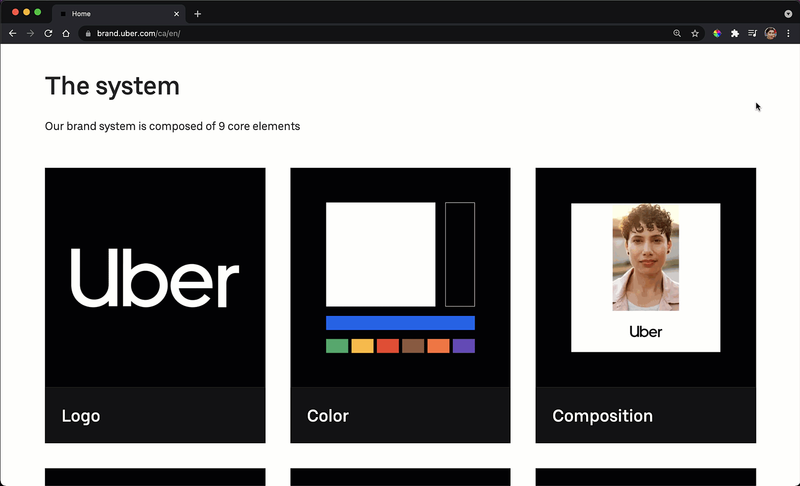
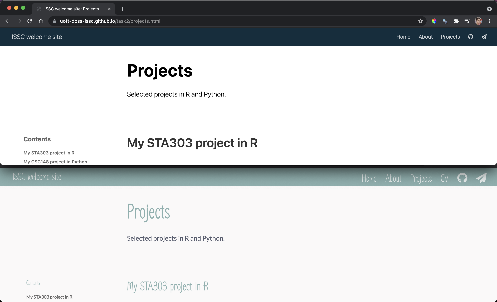
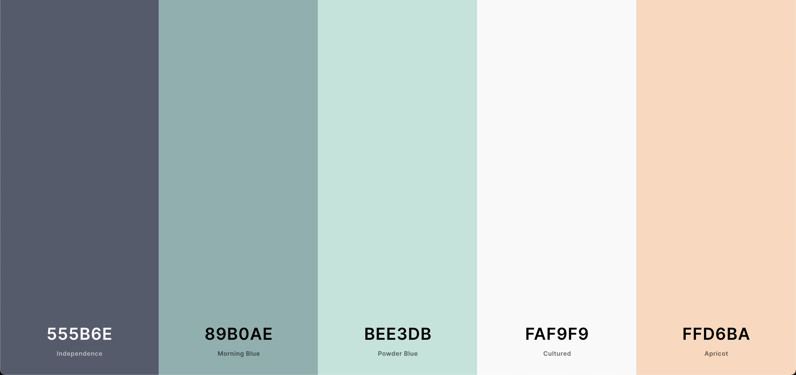
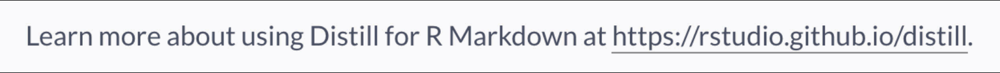
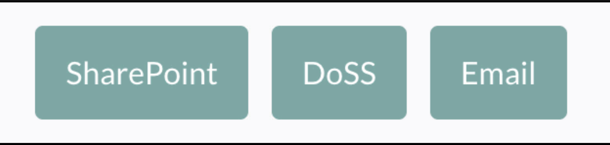

# Introduction

There are many, many ways to make a website these days. This workshop series aims to help you make a personal website using the [`distill` package](https://rstudio.github.io/distill/). This is just ONE way that is used by a lots of folks in statistics and that leverages your existing R and R Markdown skills. It is reasonably beginner friendly and creates a professional looking website.

Note: If you already have a personal website, sessions 2 and/or 3 may still be of interest to you. You can attend as many or as few of these sessions as you would like.

## Why make a website?

There are many reasons why you might want or need a website (which might also be why there are so many ways to make one!). I'm going to assume your main motivations might be some subset of the below:

-   You want to make it easier for employers/prospective supervisors to find examples of your analysis and communication work, your projects (i.e., your portfolio).
-   You want to have a home for sharing your side projects with folks with similar interests.
-   You want to have a hub from which to share your bio, CV other profiles/links etc., a detailed digital business card of sorts.
-   It sounds fun!

At the core of why I'm imaging you're interested is because on some level you know that **communication** is important. You want to communicate to the world about who you are and what you can do. Building a website can be useful both as the *medium* for sharing, but also as a *method* of exploring and reflecting on how you want to communicate about yourself to the world. For this reason, this series aims to combine the coding and tools aspect, with other tasks around writing and reflection, so that once you have a website, you'll also be clear on your purpose for it, how it should look and feel, and have some things to put on it.

## What we're going to do during the workshop series

-   Get set up with R/RStudio/Git and GitHub (if not already)
-   Build a basic landing page website with `postcards`
-   Create a multi-paged paged website with `distill`
-   Begin to develop an aesthetic for your "'personal brand' [^index-1]
-   Learn some basic ways to edit the look and feel of a site with CSS
-   Set up and post a first blog post
-   Develop and polish professional content for your website and blog
-   Connect to additional U of T resources that can help you develop your professional digital presence (TBC)

[^index-1]: Do we hate the concept of 'personal brand'? I think there is some value in thinking about how we make it easier for the world to understand us...but there is so much grossness with it too...

```{r, fig.align = "center", echo = FALSE}

if (knitr:::is_latex_output()) {
  knitr::asis_output('In the HTML version of these notes there is a GIF here.')
} else {
 knitr::include_graphics("images/brentrambo.gif")
}

```

*GIF description: Boy sitting at computer turns to camera and gives a thumbs up and nods his head repeatedly. The name Brent Rambo appears on screen.*

## Details

-   [Session 1](#sesh1) was held on 2021-06-03 and a recording is available to members of the Independent Summer Statistics Community and Department of Statistical Sciences (University of Toronto) [on SharePoint](https://utoronto.sharepoint.com/sites/ArtSci-STA/ISSC/SitePages/Past-events.aspx#website-building-workshop-series-session-1).
-  [Session 2](#sesh2) was held on 2021-06-30 and a recording is available to members of the Independent Summer Statistics Community and Department of Statistical Sciences (University of Toronto) [on SharePoint](https://utoronto.sharepoint.com/sites/ArtSci-STA/ISSC/SitePages/Past-events.aspx#website-building-workshop-series-session-2-personal-brand)
- [Session 3](#sesh3) was asynchronous, all resources are available in the chapter.

Any questions? Get in touch: liza.bolton@utoronto.ca.

<!--chapter:end:index.Rmd-->

# (PART) Prerequisites {-}

# What you need to do before the first session {#prereqs}

## Decide if this is the right way of making a website for you

In order to make the most of this series, you should think about what the purpose for your personal website is going to be. 

- Is it to have a basic hub for your professional links? (A bit like the 'linktree' links you might see on Instagram.)
- Is it to share your technical portfolio and/or demonstrate your communication skills with simple blogs? Especially good if R is one of the main languages you'll be using. Also works with Python with the [`reticulate` package](https://rstudio.github.io/reticulate/).

If yes, to the above, this workshop series using `distill` is probably perfect for you. If you want a more complicated and customizable site checkout [`blogdown`](https://bookdown.org/yihui/blogdown/) (still using an R package) or [Bootstrap](https://www.w3schools.com/howto/howto_website_bootstrap.asp) (HTML/CSS) or if you need to support e-commerce, you might just want to go find which YouTuber you like has a Squarespace sponsorship this week...

## Technical tasks

To be able to engage fully with this series of workshops, you will need to have completed the steps in the Installation part of
<https://happygitwithr.com/>. This a great a resource. I also STRONGLY recommend that you try to follow the instructions in Chapter 10 so you can easily set up your new project and connect it to GitHub. 

-   <input type="checkbox" unchecked></input> Register a GitHub account
-   <input type="checkbox" unchecked></input> Get GitHub for education
    <https://education.github.com/> so you can have free private
    repositories
-   <input type="checkbox" unchecked></input> [Install or upgrade R and
    RStudio on your local machine](https://happygitwithr.com/install-r-rstudio.html)
-   <input type="checkbox" unchecked></input> [Install Git](https://happygitwithr.com/install-git.html)
-   <input type="checkbox" unchecked></input> [Introduce yourself to Git](https://happygitwithr.com/hello-git.html)
-   <input type="checkbox" unchecked></input> [Cache your credentials](https://happygitwithr.com/credential-caching.html)

For the easiest experience with website building and updating, you want to be able to push to a GitHub repo from either the Git pane in RStudio or using the terminal (which you can also access from RStudion, tab next to the console pane).

### What is GitHub and why do you want it?

We're suggesting that if you haven't already, you get yourself setup with GitHub as a key component of your portfolio building strategy, regardless of your plans to make a website with this series or otherwise. It will supercharge your version control and your ability to collaborate with others AND provides a FREE way to host a website.

Jenny Bryan has a great introduction in her [Happy Git with R](https://happygitwithr.com), so I'll let her explain the rest:

Git is a version control system. Its original purpose was to help groups of developers work collaboratively on big software projects. Git manages the evolution of a set of files – called a repository – in a sane, highly structured way. If you have no idea what I’m talking about, think of it as the “Track Changes” features from Microsoft Word on steroids.
Git has been re-purposed by the data science community. In addition to using it for source code, we use it to manage the motley collection of files that make up typical data analytical projects, which often consist of data, figures, reports, and, yes, source code.
A solo data analyst, working on a single computer, will benefit from adopting version control. But not nearly enough to justify the pain of installation and workflow upheaval. There are much easier ways to get versioned back ups of your files, if that’s all you’re worried about.
In my opinion, for new users, the pros of Git only outweigh the cons when you factor in the overhead of communicating and collaborating with other people. Who among us does not need to do that? Your life is much easier if this is baked into your workflow, as opposed to being a separate process that you dread or neglect.” - Jenny Bryan, Happy Git with R, Section 1.1: Why Git?  https://happygitwithr.com/big-picture.html
There is also lots of great practical professional advice in here, too, like “Pick a username you will be comfortable revealing to your future boss.” Save gamerangel420 for Reddit. (The first example I thought of I had to change...it actually was someone’s Reddit username)
Work through Jenny Bryan’s awesome ‘Happy Git with R’
Check out the DoSS Toolkit lesson “Git outta here”
Sign up for GitHub Education Student Developer Pack (access to hundreds of dollars worth of tools and training AND a GitHub pro account while you’re a student)


<!--chapter:end:01-prereqs.Rmd-->

# (PART) Workshop sessions {.unnumbered}

# Session 1: Build a simple website with Distill {#sesh1}

## To do before the workshop {#s1pre}

-   <input type="checkbox" unchecked></input> Complete all the steps in the [prerequisites](#prereqs) section.

-   <input type="checkbox" unchecked></input> Decide if you want to buy a [domain name (see appendix)](#domain). Buying a domain name is **totally optional**, and you don't have to decide now. But, if you know you want to, you might as well get set up now.

-   <input type="checkbox" unchecked></input> Decide what links to external things you want to share on your website. Have them easily accessible to copy and paste. *GitHub? LinkedIn? Twitter?*

-   <input type="checkbox" unchecked></input> Choose a profile picture for your website. A headshot with a simple background is best. If you don't have one/don't want to show a photo, you may want to find some other form of an avatar or placeholder picture. Have the PNG or JPEG easily available to copy to the file you'll need.

-   <input type="checkbox" unchecked></input> [Download the R Markdown cheat sheet](https://github.com/rstudio/cheatsheets/raw/master/rmarkdown-2.0.pdf) and pay special attention to the '**Pandoc's Markdown**' section on the lefthand side of the second page.

-   <input type="checkbox" unchecked></input> Install the below R packages. I.e., copy and paste the below code into your R console and run it. If you're not sure what this means or how to do it, come talk to use during a TidyTuesday and Talk session (Tuesdays, from 2:00 to 3:00 p.m. ET, on Zoom, see the [Events list](https://utoronto.sharepoint.com/sites/ArtSci-STA/ISSC/_layouts/15/Events.aspx?ListGuid=0679786c-8a7e-483c-9ec5-3845602a70e5))

```{r, eval = FALSE}
install.packages('postcards') # for landing page
install.packages('distill') # for multipage site
install.packages('usethis') # for easy connection to Git and GitHub
```

### Thank you, Rohan!

Major credit to Prof. Rohan Alexander for his teaching notes about making a website. You can find them at: <https://www.tellingstorieswithdata.com/interactive-communication.html#making-a-website>

His personal website is also made with distill, <https://rohanalexander.com/>.

## Workshop instructions

### Landing page with `postcards`

Let's start with the most basic thing we can do, create a landing page with a brief bio and some key links. It is a bit like a business card for the digital age.

This page can later become the home page of your website, or you might find you want to do something more customized.

1.  Make sure you have [installed packages you needed to.](#s1pre)

2.  Create a new R project using the postcard template:

    a.  'File -\> New Project -\> New Directory -\> Postcards Website.'.
    b.  Choose a sensible location for this project to live on your computer. I'd recommend just calling this something like 'task1'.
    c.  Pick a theme, I'd recommend trying 'trestles' for now, but you can see all the different 'looks' [here (scroll down)](https://github.com/seankross/postcards).
    d.  Choose 'Open in new session', just to be safe.

3.  Run `file.create('.nojekyll')` in your console. It will later tell GitHub something about how *not* to build your site.

4.  Open the 'index.Rmd' file and Knit it to View what it looks like.

5.  Change the title to your name, add your photo to the folder you're working in and change the image to that. Update the links with whatever you want to include. Update the text below the YAML. You might like to use the headings "Education" and "Projects" if you're likely to stick with a one-page site.

6.  Set up Git and a GitHub repo. Commit and push. There are quite a few ways to do this (see [Happy Git with R](https://happygitwithr.com/existing-github-last.html) to GitHub with the help of the `usethis` package.

    a.  In your console, run `usethis::use_git()` .

        1.  You'll be asked if it is okay to commit your uncommitted files. Read the options and enter the number for 'Yes'.

        2.  You'll then be asked about restarting so the Git panel can be available. Choose to restart.

    b.  If you configured your GitHub Personal Access Token (PAT) (see Chapter 10 of Happy Git with R: Cache credentials for HTTPS) you can run `usethis::use_github()` in your console to set up and push to a repo of the same name as the folder you set up (e.g. 'task1'). You'll be able to delete this later once your website has taken it's final form.

    c.  GitHub should open in your browser. If not, navigate to your GitHub repo for the site and go Settings (top horizontal menu) and then Pages (vertical menus on left)

    d.  Under source, change from None to master (or main if that is what your branch is called) and change /(root) to /docs and click save.

7.  Make a change and repush to GitHub using the terminal tab! (Update the commit message.) Or use the Git pane, or however else you've learned to set yourself up.

```{=html}
<!-- -->
```
    git status
    git add -A
    git commit -m "look at this hopefully meaningful message"
    git push

#### Example

I made the ISSC a landing page. You can view it at <https://uoft-doss-issc.github.io/> and the code is available on [GitHub](https://github.com/UofT-DoSS-ISSC/UofT-DoSS-ISSC.github.io).

### Multipage site

1.  Make sure you have [installed packages you needed to.](#s1pre)

2.  Create a new R project using the distill website template:

    a.  'File -\> New Project -\> New Directory -\> Distill Website.'.
    b.  Choose a sensible location for this project to live on your computer. I'd recommend just calling this something like 'task2' for now.
    c.  Tick 'Configure for GitHub pages'.
    d.  Choose 'Open in new session', just to be safe.

3.  Navigate to the **Build** tab in the environment pane (usually the top right pane in your R Studio if you haven't customized the layout) and click **Build Website**. This should create a pop-up that allows you to preview what the basic template builds.

4.  Open the **index.Rmd** file you made in task 1 and copy the entire thing into the **index.Rmd** file in your current project.

5.  Add this line to your YAML `site: distill::distill_website` for this newly transplanted **index.Rmd.** Doesn't matter which line you put it on.

6.  Now we're going to start by exploring the \_**site.yml** file. This is how you'll set up the navigation bar for your website.

    Start by updating the name, title and description. Only change the description on line 4 and keep the tab in front of the text. Wow, look at this creative example!

```{=html}
<!-- -->
```
        name: "lizawebsite"
        title: "Liza Bolton"
        description: |
        Liza Bolton

Next, let's add links to any social media or other platforms you want to promote. Don't link social media or platforms you wouldn't be comfortable with an employer seeing (and probably make those accounts private). This example is for GitHub. You can also do Twitter (\`fa-twitter\`) and LinkedIn (\`fa-linkedin\`) and probably some others.

        - icon: fa fa-github
          href: https://github.com/elb0

Want to make it easy to email you? Add your email address and a email icon or cute paper plane icon (\`fa-paper-plane\`) to the navigation bar. Or you could add these as buttons under your picture if you'd prefer.

       - icon: fa fa-envelope
         href: mailto:liza.bolton@utoronto.ca

7.  Let's create a **Projects** page. Run this code in your console: `distill::create_article("projects").` This will create a new Rmd call **projects.Rmd**. Update it, Knit it and then we'll add it to the **\_site.yml** and build the site again.

    1.  Want a table of contents? Update your YAML.

    ```{=html}
    <!-- -->
    ```
        output:
            distill::distill_article:
                toc: true
                toc_depth: 3

8.  Next, we're going to create a CV page. You can either have your CV as a PDF and set it up to open directly or create a new page with your CV information.

    1.  If you're creating a page, you'll do basically the same things as the step above.

    2.  If you have a PDF of your CV, create a new folder called **pdfs** in your main file (you could call it something else too...) and put the PDF you want in there. Then we'll add it to the navigation bar with:

```{=html}
<!-- -->
```
        - text: "CV"  
          href: pdfs/mycv.pdf

(But update the file name.)

## Other tips/resources

-   Need more help with Git/GitHub? Check out the [DoSS Toolkit tutorial](https://dosstoolkit.com/) on it.
-   Add `.DS_Store` to your `.gitignore` file (if you're on a Mac).
-   Here are the [getting started notes from the distill team](https://rstudio.github.io/distill/website.html)!
-   [This blog post from the RStudio team](https://blog.rstudio.com/2020/12/07/distill/) is a great feature summary for the `distill` package.
-   Explore the [Distillery Showcase](https://distillery.rbind.io/showcase.html) of websites made with Distill! Some great inspiration here.

## Setting up a custom domain

It can take a while (like, a day or so) to update the redirection between your GitHub page and your domain, so be prepared to be patient!

These instructions are quite good: <https://richpauloo.github.io/2019-11-17-Linking-a-Custom-Domain-to-Github-Pages/>

## Post-workshop tasks

-   <input type="checkbox" unchecked></input> Check-in with yourself: What was fun about today? What did you learn? What did you find challenging? Did anything make you want to give up? If so, was why should you keep going with your website?
-   <input type="checkbox" unchecked></input> Fill out this [short 'ticket out the door' survey.](https://forms.office.com/Pages/ResponsePage.aspx?id=JsKqeAMvTUuQN7RtVsVSEOKHUU3SzAJJhmOKjJhDWEpUQUJETTYxTkhUVUlQU0VUOEFFMlBWTjA2Vy4u)
-   <input type="checkbox" unchecked></input> Do a social media audit. What are you happy with being public and what is private to close friends/family, etc.
-   <input type="checkbox" unchecked></input> Continue to update your bio, links.
-   <input type="checkbox" unchecked></input> Make a site plan. What other pages would you like to add? Maybe a testimonials page?
-   <input type="checkbox" unchecked></input> Start thinking about what colours you like and/or what colours would help communicate your personality. Currently your site will have a blue navigation bar, but we will learn some basic ways to change the look and feel in our next session.
-   <input type="checkbox" unchecked></input> Add your website URL to your email signature, once you feel it is in an okay state of readiness. We're also going to add more to it over the next few sessions so feel free to wait, too.

<!--chapter:end:02-session1.Rmd-->

# Session 2: Personal brand

**These resources were prepared by [Megan Whitehead-Douglas, Assistant Manager, Employer Relations & Career Development](https://www.statistics.utoronto.ca/people/directories/staff/megan-whitehead-douglas-med), for the ISSC.**

You can find the slides and workbook from this session, below.

## Slides

<object data="pdf/Discovering Your Personal Brand ISSC June 2021 FINAL.pdf" type="application/pdf" style="width:100%;height:500px">

<embed src="pdf/Discovering Your Personal Brand ISSC June 2021 FINAL.pdf" type="application/pdf">

</object>

## Workbook

Download this document to complete it for yourself.

<object data="pdf/Personal Branding Workbook.pdf" type="application/pdf" style="width:100%;height:1100px">

<embed src="pdf/Personal Branding Workbook.pdf" type="application/pdf">

</object>

<!--chapter:end:03-session2.Rmd-->

# Session 3: Writing and design

Due to timing, this session was converted to asynchronous. All the resources are below.

## Writing, colour and font advice

**These slides were prepared by [Dee Keilholz, Communications Officer](https://www.statistics.utoronto.ca/people/directories/staff/megan-whitehead-douglas-med), for the ISSC.**

<iframe src="https://docs.google.com/presentation/d/1BWs_5wnoWR3vhI_layCnnz2QfUMs5IGJHQNDLnw6JD4/embed" style="width:100%;height:500px">

</iframe>

## Colours

There are SO many ways to mix, match and pick colours.

If you're looking for some inspiration, I recommend playing with [coolors.co](https://coolors.co/). Once you go to the site, click 'Start the generator!' and play with it to get a colour palette you like. You'll see the hexcodes (6, hence 'hex', letters/numbers with a hashtag[^session3-1], \#) at the bottom of the swatches.

[^session3-1]: 🤔 Did you know? The real name of the \# symbol, called the 'pound' symbol by some, is 'octothorp'.

<i class="fa fa-chevron-circle-right"></i> [*You might also like these slides about colours and ggplot from Tidy Tuesday and Talk.*](https://uoft-doss-issc.github.io/ggplot-colour-palettes/ggplot-colour-palettes.html#1)

When I am working with a client and need to use their colours, either they send me a brand guide with information about the colours, in the form of hexcodes and/or RGB values (e.g. this guide to brand colours from [Uber](https://brand.uber.com/us/en/color/)), or I use a tool like the [ColorPick Eyedropper](https://chrome.google.com/webstore/detail/colorpick-eyedropper/ohcpnigalekghcmgcdcenkpelffpdolg?hl=en) extension for Chrome to get the codes for the colours they use on their website.

```{r, fig.align = "center", echo = FALSE}

if (knitr:::is_latex_output()) {
  knitr::asis_output('In the HTML version of these notes there is a GIF here.')
} else {
 
}

```

*GIF description: Demonstration of the Colour Pick Eyedropper extension for Chrome to 'pick' colours from Uber's brand site.*

## Editing your CSS (demo)

Cascading Style Sheets (CSS) let you modify the colours, fonts, spacing and other design features of your website in a consistent way. If you've used 'Styles' in Microsoft Word, it is a similar idea, e.g., everything of type Heading 1 will look the same. I've never taken a formal course in CSS and just learn things as I need them, so am in no way an expert. Believe in your ability to Google! Check out this much more thorough introduction from [W3 Schools](https://www.w3schools.com/css/css_intro.asp).

Our goal is to create and edit a .css file that has the instructions for how different elements of our website should look.

**For a more more comprehensive introduction, check out the following instructions from the Distill for R team for a range of examples and key information: <https://rstudio.github.io/distill/website.html#theming>.**


In session 1, I created the following site for the ISSC: <https://uoft-doss-issc.github.io/task2/>. In this demo we are going to go from the top panel to the bottom panel of the below image. Note the changes to the fonts, sizes and colours.

```{r, fig.align = "center", echo = FALSE}

```

Suppose I played with www.coolors.co and decided I liked [this palette](https://coolors.co/555b6e-89b0ae-bee3db-faf9f9-ffd6ba) and want to make all my titles be in a cutesy font like [Zen Loop](https://fonts.google.com/specimen/Zen+Loop) but go for something standard, like [Lato](https://fonts.google.com/specimen/Lato), for the main (body) text

```{r, fig.align = "center", echo = FALSE}

```

I want to make the following changes:

1.  Change the header bar colour from bluish to 'Morning Blue'.

2.  Turn links in the header bar 'Apricot' when I hover over them.

3.  Make the background of the side 'Cultured'.

4.  Make all my body text be the 'Independence Blue' colour.

5.  Make all the headings 'Morning Blue'.

6.  Turn links in body text 'Powder Blue' when hovered over.

7.  Set my headings to be in the Zen Loop font.

    1.  Make the website title (left side of navbar) and the links (right side of the navbar) 30px (title-size & text-size in the .distill-site-header class).

    2.  Set h1 (the ISSC under the picture, likely to be your name in yours, if you used postcards) to size 100px.

    3.  Set h2 (the Bio/Education/Experience on the homepage) to 60px.

8.  Set my body text be in the Lato font.

Here is how I would achieve this:

### Create the CSS file

First, we need to create a file of type .css for us to store our instruction. Once you're in the project for your website, run the following code in your console:

`distill::create_theme()`

This will create a new file called **theme.css** in the folder you're working in.

### Add your CSS to \_site.yml

Next, you'll need to actually tell the computer to use that file for style instructions. Open your **site.yml** file and add `theme: theme.css` on a new line. Below is what my **\_site.yml** file looks like after adding the theme information on **line 6**.

    name: "ISSC website"
    title: "ISSC welcome site"
    description: |
      ISSC welcome site!
    output_dir: "docs"
    theme: theme.css
    navbar:
      right:
        - text: "Home"
          href: index.html
        - text: "About"
          href: about.html
        - text: "Projects"
          href: projects.html
        - text: "CV"
          href: pdfs/STA303-1002_syllabus_W21.pdf
        - icon: fa fa-github
          href: https://github.com/elb0
        - icon: fa fa-paper-plane
          href: mailto:liza.bolton@utoronto.ca
    output: distill::distill_article

### Change colour of the navigation bar

The first change I am going to make will be to the *navigation bar's background colour*. In the new **theme.css** file, I'm going to go to line 66 and change the hexcode next to `--bkgd-color:` from \#0F2E3D to \#89B0AE.

    .distill-site-header {
      --title-size:       18px;
      --text-color:       rgba(255, 255, 255, 0.8);
      --text-size:        15px;
      --hover-color:      white;
      --bkgd-color:       #0F2E3D;
    }

to

    .distill-site-header {
      --title-size:       18px;
      --text-color:       rgba(255, 255, 255, 0.8);
      --text-size:        15px;
      --hover-color:      white;
      --bkgd-color:       #89B0AE; /* Morning Blue */
    }

### Change link hover colour (in the navigation bar)

To change the colour of the links in the navigation bar when we *hover* over them, we just need to change the value next to `--hover-color:` in the `.distill-site-header` section. I.e., change `--hover-color:      white;` to `--hover-color:      #FAF9F9;`. Don't forget the \#.

### Change page background

To change the *background colour of the pages*, I'm going to add a completely new element to the CSS file. You can out it wherever you want, I've got mine right after all the `html` section. Note that things in /\* \*/ are comments in CSS, like how text after \# in R code is not read by the computer. I've put the names of the colours next to the codes as that will make it easier to find/remember what I've done.

    /* Change the background colour of the pages */

    body {
      background-color: #FAF9F9; /* Culutred */
    }

### Change the colour of the body text

This is all the 'normal' text on your pages. To make the change on both your postcards front page, and in any additional distill created pages, you'll want to edit some of the default CSS and add some new classes.

To change the body colour on Distill created pages all you need to do is update the colour code next to `--body-color:` in the `html` section.

To change the colour on the postcards based homepage add a new element, just like we did above to change the page colour. `p` (for paragraph?) refers to all our normal text.

    p {
      color: #555B6E; /* Independence */
    }

### Change all heading colours

To change the title and heading colours on the Distill pages (like About and Project, in my example), change the colour codes next to the `--title-color`: and `--header-color:` in `html`.

      --title-color:     #89B0AE; /* Morning Blue */
      --header-color:    #89B0AE; /* Morning Blue */

For the title and headings on the home page add new elements for `h1` (heading 1, the "ISSC" title under the picture in my example) and `h2` (Bio/Experience etc.)

    h1 {
      color: #89B0AE;
    }

    h2 {
      color: #89B0AE;
    }

### Change link hover colour in body text

You can make hyperlinks change colour when you hover over them---see the GIF below for what I mean. Is this important to do? No, not really. But you CAN do it.

```{r, fig.align = "center", echo = FALSE}

if (knitr:::is_latex_output()) {
  knitr::asis_output('In the HTML version of these notes there is a GIF here.')
} else {
 
}

```

*GIF description: Example of Link text change from the same colour as surrounding to text to a new colour when the mouse is 'hovered' over it.*

To get this, just add the text below to your **theme.css** file as a new element.

    a:hover {
      color: #BEE3DB; /* Powder Blue */
    }

### Font types and sizes

To changes the fonts, I must first import the fonts I want from the [Google font API](https://fonts.google.com/).

Find the fonts you like, paying attention to the styles as well. For example, Lato has 'Thin 100' which was very hard to read on the site. 'Regular 400' is much better suited to our needs. When you have a typeface and style you like, click '+Select this style' next to the font. For this example, I want Zen Loop and Lato (both regular 400).

```{r, fig.align = "center", echo = FALSE}

if (knitr:::is_latex_output()) {
  knitr::asis_output('In the HTML version of these notes there is a GIF here.')
} else {
 knitr::include_graphics("images/fonts.gif")
}

```

*GIF description: Navigating fonts.google.com to select Lato and Zen Loop font styles, then accessing the code to import them from the "Use on the web' part of the 'Selected families tray'. Used @import instead of the \<link\> option.*

Add your font code to the top of your CSS. It can/should be after the first chunk of comments, you'll actually see lines 11 & 12 talking about the fonts, so I've added my code to line 13.

`@import url('https://fonts.googleapis.com/css2?family=Lato&family=Zen+Loop&display=swap');`

This will import your fonts, but you also need to specify how/where to use them.

In the `html` section, look for the part that talk about fonts:

      /*-- Specify custom fonts ~~~ must be imported above   --*/
      --heading-font:    'Zen Loop', cursive;
      --mono-font:       monospace;
      --body-font:       'Lato', sans-serif;
      --navbar-font:     'Zen Loop', cursive;  /* websites + blogs only */

I have added my 'fancier' heading font next to `heading-font` and `navbar-font`. I know how to put this in based on the Google fonts API information about my selected fonts under 'CSS rules to specify families' in the 'Selected families tray'. Take the part *after* `font-family` for this part of your code and put it after the type of font in the code above (i.e., after `heading-font` or `body-font`).

    font-family: 'Lato', sans-serif;
    font-family: 'Zen Loop', cursive;

Same idea to make your body font Lato: `--body-font:       'Lato', sans-serif;`.

BEcause of the postcards created home page, I'm also going to make some additions to the `h1`, `h2` and `p` elements I defined above. You can see that I have also changed my font sizes in here, too.

    p {
      color: #555B6E; /* Independence */
      font-family: 'Lato', sans-serif;
    }

    h1 {
      color: #89B0AE;
      font-family: 'Zen Loop', cursive;
      font-size: 100px;
    }

    h2 {
      color: #89B0AE;
      font-family: 'Zen Loop', cursive;
      font-size: 60px;
    }

For the final font size changes in this section, I made `--title-size` 60px (in the `html` section), and in the `.distill-site-header` (which gives the instructions for how the navigation bar looks) I made `--title-size and` `--text-size` 30px.

### Finished product

Here is what the site now looks like, with all these changes: <https://uoft-doss-issc.github.io/task3/projects.html>

You can see all my code, especially the contents of my **theme.css** file on GitHub: <https://github.com/UofT-DoSS-ISSC/task3>.

Here is the CSS file directly: <https://github.com/UofT-DoSS-ISSC/task3/blob/master/theme.css>

As with R or Python, I learn a lot about how to do cool things with code from seeing what others do. [The Distillery](https://distillery.rbind.io/) is a great resource, full of example sites for which the full code is available. Get inspired!

```{r, fig.align = "center", echo = FALSE}
knitr::include_graphics("images/distillery.png")
```


As a bonus activity, change your button colours! This is the code for the buttons on the Distillery homepage. Add it to your CSS if you've got buttons on a postcards homepage.

```
/* Style the buttons */
.btn {
  border: none;
  outline: none;
  padding: 12px 16px;
  color: white;
  background-color: var(--bkgd-color, #0F2E3D);
  cursor: pointer;
}

/* Add a light grey background on mouse-over */
.btn:hover {
  background-color: #143d52;
  color: white
}

/* Add a dark background to the active button */
.btn.active {
  background-color: #1e5c7b;
  color: white;
}

```

Here is a version I did for the ISSC example site:

```
/* Style the buttons */
.btn {
  border: none;
  outline: none;
  padding: 12px 16px;
  color: white;
  background-color: var(--bkgd-color, #89B0AE);
  cursor: pointer;
}

/* Add a light grey background on mouse-over */
.btn:hover {
  background-color: #BEE3DB; /* Powder Blue */
  color: white; 
}

/* Add a dark background to the active button */
.btn.active {
  background-color: #89B0AE;
  color: white;
}
```

```{r, fig.align = "center", echo = FALSE}

if (knitr:::is_latex_output()) {
  knitr::asis_output('In the HTML version of these notes there is a GIF here.')
} else {
 
}

```

*GIF description: Hovering over buttons on ISSC example site home page. The buttons are now 'Morning Blue' and turn 'Powder Blue' when you hover over them.*

# Useful things not covered

Things we didn't get to that I'd like to cover eventually...

-   [Want to get more complicated with your CSS editting? Use something like the CSS selector gadget to identify components of site. Useful for webscraping, too.](https://chrome.google.com/webstore/detail/selectorgadget/mhjhnkcfbdhnjickkkdbjoemdmbfginb?hl=en)
-   [Setting up a blog. I've actually got mine set up as a seperate site, but you can do it multiple ways.](https://rstudio.github.io/distill/blog.html)
-   [How to have your finished site be at yourname.github.io instead of yourname.github.io/website. Hint: it is all about the repo name.](https://docs.github.com/en/pages/getting-started-with-github-pages/about-github-pages)

<!--chapter:end:04-session3.Rmd-->

# (APPENDIX) Appendix {-}

# Buy a domain name (optional) {#domain}

You __do not have to buy anything__ to build and host a professional personal website as a student. BUT, if you've always wanted to own www.firstnamelastname.com, here are some instructions. Note, if you're not sure what a domain name is there are heaps of explainer articles online, just search "what is a domain name". You don't really need to know too much.

### Some caveats

- I'd recommend doing some of your own further research to make sure this is actually the best approach for you and what you actually want or need.
- This isn't legal or financial advice. Duh. 


### Don't pay full price! 

There is almost always a deal going on. May not still be live when you're looking, but 'nameboy' was a code for 25% of domains.com when I was setting up mine.

## But what if you don't buy a domain name?

If you don't want to buy a domain name, your personal website's address will appear as: `your-github-username.github.io`. Even more reason to choose a good username! See more in the [prerequisite secion](#prereqs).

For example, I made a simple landing page for the ISSC at https://uoft-doss-issc.github.io/.

<!--chapter:end:05-domain.Rmd-->

